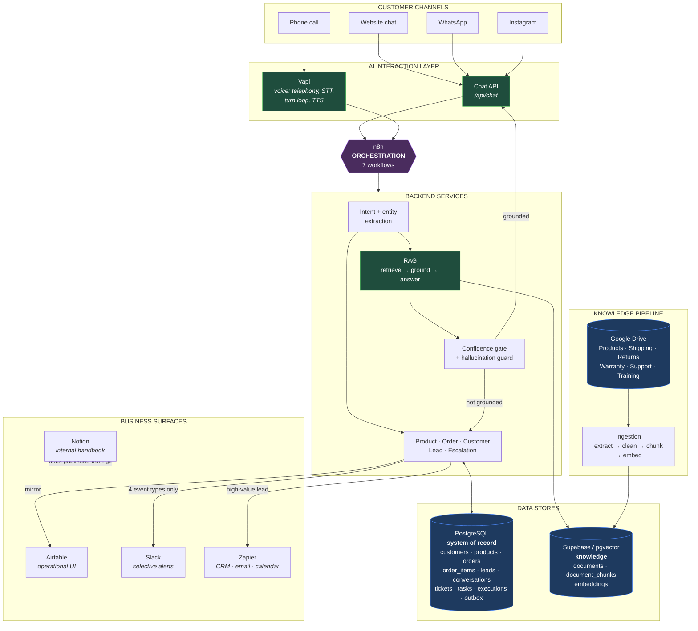
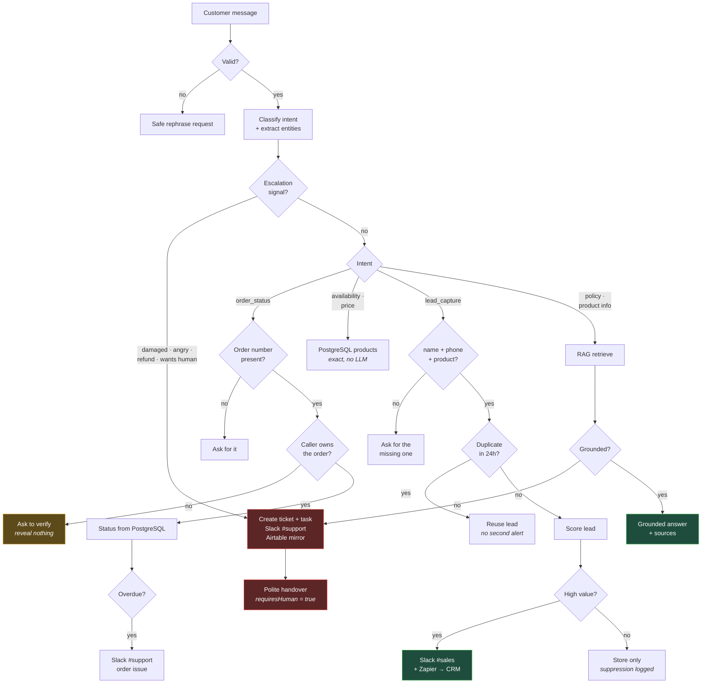
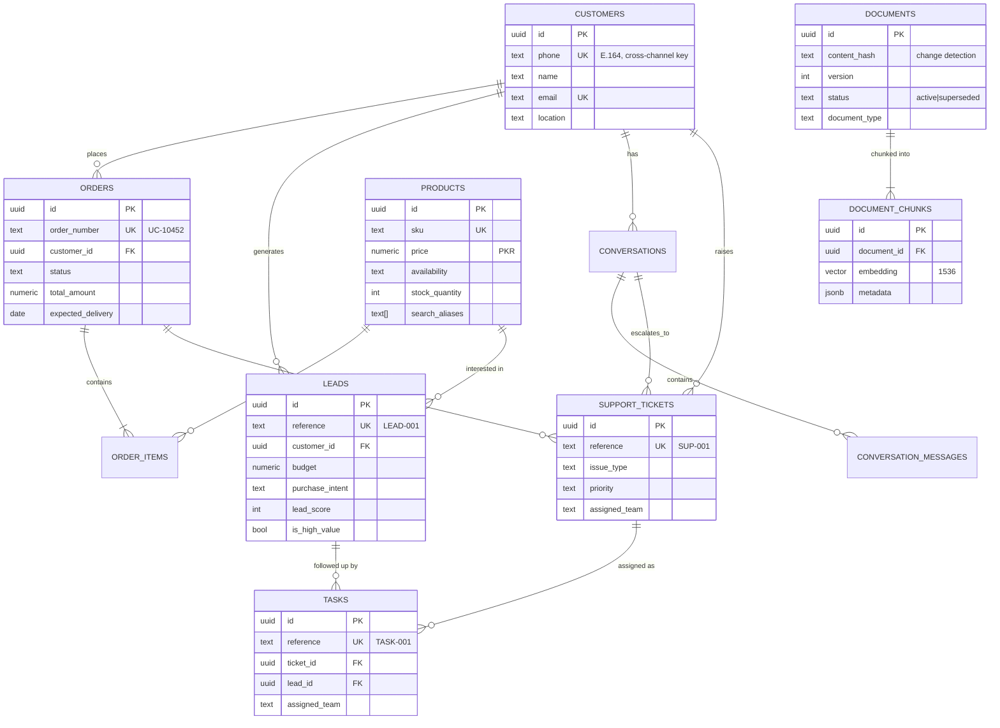
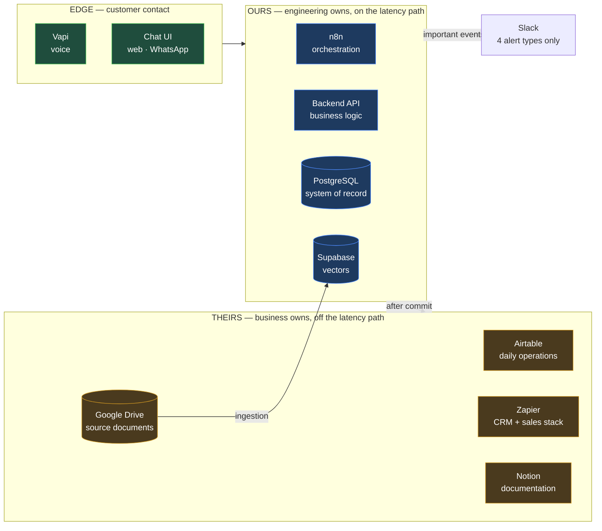
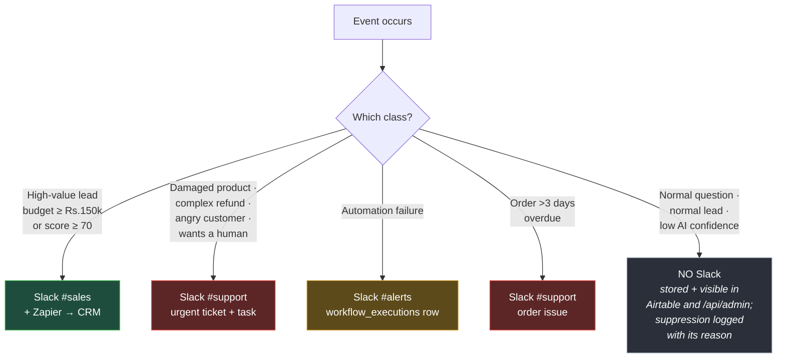

# UrbanCart — Architecture Diagrams

All diagrams are Mermaid. They render natively on GitHub, in VS Code (Markdown
Preview Mermaid extension), in Notion, and at <https://mermaid.live>.

---

## 1. System architecture



---

## 2. RAG pipeline — document to grounded answer

```mermaid
flowchart LR
    A["Google Drive<br/>PDF · DOCX · XLSX"] --> B["Detect new<br/>or changed<br/><i>SHA-256 hash</i>"]
    B -->|unchanged| B1["Skip<br/><i>no embedding cost</i>"]
    B -->|changed| C["Download"]
    C --> D["Extract text<br/><i>unpdf · mammoth<br/>· exceljs</i>"]
    D --> E["Clean<br/><i>de-hyphenate, strip<br/>headers, unescape</i>"]
    E --> F["Chunk<br/><i>heading-aware,<br/>900 chars, 150 overlap</i>"]
    F --> G["Embed<br/><i>1536-dim</i>"]
    G --> H[("Supabase<br/>pgvector<br/>HNSW index")]

    I["Customer question"] --> J["Classify intent"]
    J --> K["Pick document types<br/><i>metadata filter</i>"]
    K --> L["Embed question"]
    L --> M["Cosine search<br/><i>match_document_chunks</i>"]
    H --> M
    M --> N{"Confidence<br/>≥ threshold?"}
    N -->|"no"| O["ESCALATE<br/><i>ticket + human</i>"]
    N -->|"yes"| P["LLM with<br/>grounding prompt"]
    P --> Q{"Numeric claims<br/>traceable to<br/>evidence?"}
    Q -->|"no"| O
    Q -->|"yes"| R["Grounded answer<br/>+ sources"]

    style O fill:#5c2626,stroke:#f85149,color:#fff
    style R fill:#1f4d3d,stroke:#3fb950,color:#fff
    style N fill:#5c4a1a,stroke:#d29922,color:#fff
    style Q fill:#5c4a1a,stroke:#d29922,color:#fff
```



---

## 3. One chat turn — decision flow



---

## 4. Data model



---

## 5. Platform responsibilities



---

## 6. Escalation and notification policy



---

## 7. Failure handling

```mermaid
sequenceDiagram
    participant C as Customer
    participant N as n8n
    participant B as Backend
    participant D as PostgreSQL
    participant S as Slack #alerts

    C->>N: "Can I return this?"
    N->>B: POST /api/chat
    B->>D: retrieve knowledge
    D--xB: connection refused

    Note over B: AppError(DATABASE_ERROR)<br/>safeMessage set, notify = true

    B->>D: record failed execution
    Note over B,D: best-effort; failure here<br/>must not mask the original
    B->>S: ⚠️ Automation Failed<br/>(internal detail)
    B-->>N: 200 + safe customer message
    N-->>C: "I'm having trouble with that<br/>right now. Our team has been<br/>notified and will follow up."

    Note over C: never sees a stack trace,<br/>a SQL error, or a 500
```
